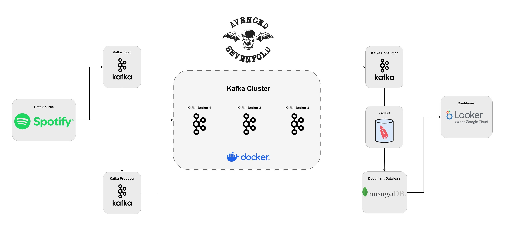
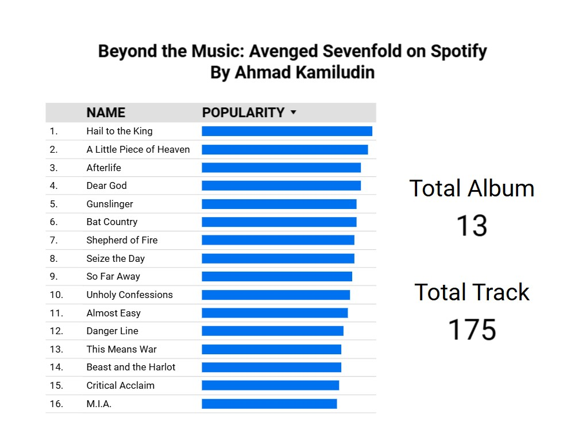

# Real-Time Music Data Streaming Using Apache Kafka

## Introduction

In this article, we outlined a comprehensive workflow for real-time music data streaming using Apache Kafka, focusing on data from Avenged Sevenfold sourced from Spotify. We covered the setup of the Confluent Platform, creation and management of Kafka topics, and the use of ksqlDB for processing and transforming streaming data with SQL-like queries. We also utilized Kafka Connect to transfer data seamlessly to MongoDB and demonstrated how to visualize this data using Looker Studio connected via CData Connect Cloud. This approach showcases the power and flexibility of modern data streaming technologies, enabling efficient handling and analysis of real-time streaming data for valuable insights and dynamic visualizations in both personal and professional applications.

## Architecture 

## Simple Dashboard

## Technology Used
- Python
- SQL
- Apache Kafka
- Docker
- Looker Studio

## Dataset Used
The data used in this project is sourced from the Spotify API and focuses on the band Avenged Sevenfold. The project retrieves comprehensive information about the band, including artist details such as the artist's ID, name, follower count, genres, and popularity. It also collects data on the band's albums, including the album ID, artist ID, name, and release date. Furthermore, the project gathers detailed track information for each album, covering various audio features such as track ID, album ID, name, popularity, danceability, energy, key, loudness, mode, speechiness, acousticness, instrumentalness, liveness, valence, and tempo.

More info about Spotify API:
https://developer.spotify.com/

## Article About this Project 
Medium Article - https://medium.com/@ahmadkamiludin/real-time-music-data-streaming-using-apache-kafka-leveraging-avenged-sevenfold-data-from-spotify-25304abcb9bb

